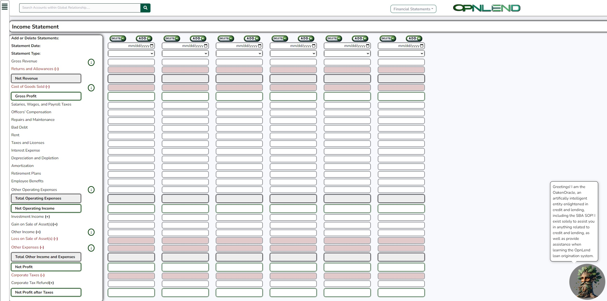

**_*Update 12/19/2023: In the spirity of transparency, I've uploaded some initial files. However, it will likely be difficult to make sense of them in the current disorganized state of this repository. Once I complete alpha testing of the spreading functionality, I'll complete a full overhall of this repository to best organize it going forward. *_**

**_*Update 12/17/2023: I've been working on the dynamic financial spreading front-end for the last two weeks and am nearing completion. Once completed, I'll update the files within this repository. In the meantime, if you are interested, you can test the functionality of the spreading model while keeping in mind that it is incomplete and contains bugs that will be resovled soon. That model can be accessed here: https://credit.opnlend.com/Financials/ *_**

**_A framework for an open source, modular commercial and government guaranteed (SBA and USDA) loan origination system._**

**_The intent of this project is an "ala carte" approach. The "core apps" are intended to be Loans, Relationships, and Spreading. Each additional app is to be individually installed to the individual or institution's needs (Deposits, Collateral, Profiles, etc.). Later down the road, possibly adding support for the installation of "Third Party Plugins" for community made content (data visualization packages, support for credit reporting agency data pulls, analysis tools, etc.).  Furthermore, it is to be locally hosted; mitigating risk of downtime when compared to a 3rd party cloud server, as the web application would remain accessable on a local area connection. I am currently developing this within a Djano container (LXC) hosted on my Proxmox home server, integrated with my PostgreSQL database hosted in a separate LXC. I'll likely integrate the relational database solution within the web-hosted application as an optional (Docker) database, while providing the ability for an institution to integrate their own database soluition._**

**Introduction**

I'm in the very beginning stages, including planning and design. While I have been working in commercial credit/underwriting for the last decade, I'm still very much learning at coding outside of VBA. However, I have experience utilizing various different loan origination systems (Fusion Credit Quest, Abrigo Sageworks, nCino, and others), collaborated with LOS engineers when improving financial institutions' existing integrations, and developed various auto filled templates to improve efficiencies. Lastly, using VBA and Microsoft UserForms, along with Microsoft Acccess as an SQL database solution, I've developed simple loan origination systems with the underlying intent on automating redudant tasks. That system inclusive of automated credit memo generation, automated spreading of PDF form fields, and other features more commonly found in (expensive) loan origination systems.

I'm more so using this application as a learning project to continue learning coding while applying my professional commercial credit experience.
